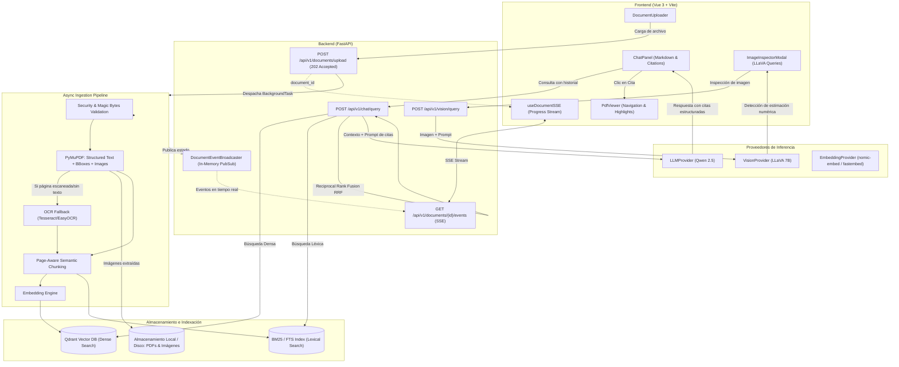

# Sistema de Análisis Interactivo y RAG Multimodal sobre Documentos PDF Complejos

Diseño arquitectónico y plan de implementación para un sistema de grado productivo para procesamiento asíncrono, indexación híbrida y consulta conversacional multimodal sobre documentos PDF complejos (20 a cientos de páginas), desacoplado mediante interfaces y con soporte de inferencia local.

---

## User Review Required

> [!IMPORTANT]
> **Alineación de Modelos e Inferencia Local**
> El sistema implementará el patrón proveedor (`EmbeddingProvider`, `LLMProvider`, `VisionProvider`) orientado a:
> 1. **Texto & Razonamiento:** `Qwen 2.5` vía Ollama (`/api/chat` o `/api/generate`).
> 2. **Visión Multimodal:** `LLaVA 7B` vía Ollama (`/api/generate` con payload base64).
> 3. **Embeddings:** `nomic-embed-text` / `bge-base` vía Ollama, con fallback automático a `fastembed` (ONNX local ultrarrápido sin dependencias de GPU) para garantizar funcionamiento ininterrumpido en entornos donde los pesos de Ollama aún no se hayan descargado.
> ¿Deseas confirmar este orden de resolución o forzar exclusivamente Ollama?

> [!NOTE]
> **Docker Compose y Servicios**
> Se configurará `docker-compose.yml` orquestando los 4 servicios (`backend`, `frontend`, `qdrant`, `ollama`) con volúmenes persistentes y redes dedicadas. El backend también podrá ejecutarse en modo desarrollo local conectándose a los servicios expuestos.

---

## 1. Arquitectura del Sistema y Contratos de Datos

### Diagrama de Flujo de Ingestión y RAG



### Contratos de Datos (Pydantic V2 / TypeScript)

#### 1. Ingestión y Estados
- `DocumentStatus`: `"uploaded" | "extracting" | "ocr_processing" | "chunking" | "indexing" | "ready" | "failed"`
- `ChunkMetadata`:
  ```python
  class ChunkMetadata(BaseModel):
      chunk_id: str
      document_id: str
      page_number: int
      bbox: list[float] | None = None
      associated_image_ids: list[str] = []
  ```
- `ExtractedImageMetadata`:
  ```python
  class ExtractedImageMetadata(BaseModel):
      image_id: str
      document_id: str
      page_number: int
      bbox: list[float] | None = None
      width: int
      height: int
      file_path: str
      url: str
  ```
- `SSEEventPayload`:
  ```python
  class SSEEventPayload(BaseModel):
      document_id: str
      status: DocumentStatus
      progress_percent: float
      message: str
      error: str | None = None
      timestamp: float
  ```

#### 2. RAG y Citaciones
- `Citation`:
  ```python
  class Citation(BaseModel):
      page_number: int
      chunk_id: str
      snippet: str
  ```
- `RAGResponse`:
  ```python
  class RAGResponse(BaseModel):
      answer: str
      citations: list[Citation]
      metrics: dict[str, float]
  ```

#### 3. Visión y Estimación Numérica
- `VisionQueryRequest`:
  ```python
  class VisionQueryRequest(BaseModel):
      document_id: str
      image_id: str
      prompt: str
  ```
- `VisionQueryResponse`:
  ```python
  class VisionQueryResponse(BaseModel):
      image_id: str
      analysis: str
      has_numerical_estimates: bool
      estimation_warning: str | None = None
      metrics: dict[str, float]
  ```

---

## 2. Plan de Ejecución por Fases

### Fase 1: Infraestructura y Modelos de Datos
- **Estructura base:** Crear la jerarquía completa de carpetas según la especificación.
- **Configuración (`.env` & `core/config.py`):** Variables para rutas de almacenamiento, puertos, Qdrant URL, Ollama URL, modelos por defecto (`qwen2.5:7b`, `llava:7b`, `nomic-embed-text`), límites de tamaño de archivo (50MB) y timeouts.
- **Seguridad (`core/security.py`):**
  - Validación de MIME `application/pdf`.
  - Verificación estricta de Magic Bytes `b"%PDF-"`.
  - Sanitización de nombres con prevención de Path Traversal (`re.sub`, `Path.name`).
  - Manejo de cuotas y borrado seguro de temporales.
- **Logging estructurado (`core/logging.py`):** Configuración de JSON formatter con timestamps ISO, niveles y metadatos contextuales.
- **Docker Compose (`docker-compose.yml`):**
  - Servicio `backend` (FastAPI + Uvicorn).
  - Servicio `frontend` (Nginx / Vite preview).
  - Servicio `qdrant` (Qdrant persistente con volumen `qdrant_data`).
  - Servicio `ollama` (Ollama con volumen `ollama_models`).
- **Interfaces de Proveedores (`services/providers/base.py`):**
  - `EmbeddingProvider` (ABC: `embed_text`, `embed_documents`, `dimension`).
  - `LLMProvider` (ABC: `generate_response`).
  - `VisionProvider` (ABC: `analyze_image`).
  - Implementaciones concretas con reintentos exponenciales (`tenacity`) para Ollama.

### Fase 2: Pipeline de Ingestión Asíncrono y SSE
- **Servicio de Extracción (`services/ingestion/extractor.py`):**
  - Apertura con `PyMuPDF` (`fitz`).
  - Extracción de texto estructurado por bloques y coordenadas (`page.get_text("blocks")`).
  - Extracción de imágenes con xref, guardado en `storage/documents/{doc_id}/images/{image_id}.png` y cálculo de bounding box en la página (`page.get_image_rects(xref)`).
  - **OCR Fallback (`services/ingestion/ocr.py`):** Detección heurística de páginas escaneadas (densidad de caracteres < 50 o ausencia de bloques de texto). Renderizado de página a pixmap y ejecución de Tesseract/EasyOCR.
- **Segmentación Semántica (`services/ingestion/chunker.py`):**
  - Chunking semántico respetando límites de página, párrafos y oraciones.
  - Asociación de `associated_image_ids` presentes en la misma página o región adyacente.
  - Atribución de `bbox` representativo del bloque o página.
- **Indexación Dual (`services/retrieval/`):**
  - Cliente Qdrant (`services/retrieval/qdrant_store.py`): Creación de colecciones con métrica Coseno, subida en lotes con payload estructurado (`ChunkMetadata` + `text`).
  - Indexador léxico BM25 (`services/retrieval/bm25_store.py`): Tokenización y cálculo de puntajes Okapi BM25 persistible por documento.
- **Endpoint Asíncrono y SSE:**
  - `POST /api/v1/documents/upload`: Recibe PDF, valida tamaño y magic bytes, guarda en disco seguro, registra estado `uploaded`, responde `202 Accepted` de inmediato con `document_id`.
  - `DocumentEventBroadcaster` (`services/ingestion/broadcaster.py`): Implementación de colas asíncronas pub-sub para emitir eventos de la máquina de estados: `uploaded` -> `extracting` -> `ocr_processing` -> `chunking` -> `indexing` -> `ready` | `failed`.
  - `GET /api/v1/documents/{id}/events`: Streaming SSE con `text/event-stream` que emite el progreso en tiempo real y métricas de latencia de extracción.

### Fase 3: Motor RAG Híbrido e Inferencia Multimodal
- **Búsqueda Híbrida y Reciprocal Rank Fusion (RRF):**
  - `HybridRetriever`:
    - Ejecuta en paralelo consulta densa a Qdrant (top $K$) y consulta léxica a BM25 (top $K$).
    - Aplica RRF con factor de suavizado $k=60$:
      $$RRF\_score(d) = \frac{1}{60 + \text{rank}_{dense}(d)} + \frac{1}{60 + \text{rank}_{bm25}(d)}$$
    - Desduplica por `chunk_id` y devuelve los chunks de mayor relevancia fusionada.
- **Generación Aumentada con Citas Verificables (`services/retrieval/rag_engine.py`):**
  - Ensambla contexto con delimitadores estrictos:
    `[CHUNK_ID: {chunk_id} | PAGINA: {page_number}]\n{chunk_text}`
  - Prompt del sistema con instrucciones rígidas anti-alucinación: responder exclusivamente a partir del contexto y citar obligatoriamente las fuentes con etiquetas identificables.
  - Extractor y validador de citas: asocia cada cita con `page_number`, `chunk_id` y extrae el fragmento exacto (`snippet`) para verificación en el visor.
- **Inferencia Multimodal con LLaVA 7B (`services/retrieval/vision_engine.py`):**
  - Recupera la imagen por `image_id` desde el disco.
  - Invoca `VisionProvider` (LLaVA 7B) pasando la imagen en base64 y el prompt del usuario.
  - **Detector de Estimación Numérica:**
    - Si la respuesta contiene cifras, porcentajes, magnitudes o tablas inferidas visualmente de un gráfico, marca `has_numerical_estimates = True`.
    - Genera la advertencia explícita para la UI: *"Aviso: Esta respuesta contiene valores numéricos interpretados visualmente a partir de la imagen/gráfico mediante LLaVA 7B. Pueden ser estimaciones aproximadas y deben contrastarse con los datos fuente del documento."*
- **Endpoints de Chat y Visión:**
  - `POST /api/v1/chat/query`: Recibe consulta y `document_id`, ejecuta RRF + LLM, devuelve `RAGResponse` con citas y latencias (`retrieval_time`, `llm_time`, `total_time`).
  - `POST /api/v1/vision/query`: Recibe `image_id` y `prompt`, devuelve `VisionQueryResponse`.
  - `GET /api/v1/documents/{id}/images`: Lista las imágenes extraídas con sus miniaturas y metadata.
  - `GET /api/v1/documents/{id}/file`: Sirve el PDF original con soporte de byte-range para el visor.

### Fase 4: Frontend Reactivo (Vue 3 + TypeScript + Tailwind)
- **Configuración de Proyecto:** Vite + Vue 3 + TypeScript + Tailwind CSS + Lucide Icons + `pdfjs-dist` (o visor de lienzo reactivo) + `marked` (renderizado de Markdown).
- **Servicios y Composables:**
  - `types/index.ts`: Tipos TypeScript coincidentes con los esquemas Pydantic V2.
  - `services/api.ts`: Cliente HTTP tipado con Axios / Fetch.
  - `composables/useDocumentSSE.ts`: Gestión reactiva de conexión EventSource, reconexión y emisión de porcentaje/fase.
  - `composables/usePdfViewer.ts`: Estado de página actual, zoom, número total de páginas y función `goToPage(page: number, bbox?: number[])`.
  - `composables/useChat.ts`: Historial de conversación, estado de carga, métricas de latencia y gestión de citas activas.
- **Componentes:**
  - `DocumentUploader.vue`: Zona Drag & Drop con barra de progreso reactiva alimentada por SSE, indicando visualmente cada transición (`extracting` -> `ocr` -> `chunking` -> `indexing`).
  - `PdfViewer.vue`: Visor PDF multi-página con controles de zoom, paginación, barra lateral de miniaturas y capacidad de desplazamiento automático al hacer clic en una cita.
  - `ChatPanel.vue`: Mensajería interactiva con renderizado Markdown, resaltado de código, insignias de citas clicables (`[Pág. X]`) que disparan la navegación en el `PdfViewer`, y panel de métricas de rendimiento.
  - `ImageInspectorModal.vue`: Galería de figuras/gráficos extraídos de cada página del PDF, selector para consulta interactiva con LLaVA 7B, y banner de advertencia si la respuesta contiene estimaciones numéricas visuales.
  - `App.vue`: Layout integrado a pantalla completa (Split-view: Visor PDF a la izquierda, Panel de Chat/Visión a la derecha, barra superior de estado).

### Fase 5: Testing y Criterios de Aceptación
- **Tests Automatizados Backend (`tests/`):**
  - `test_security.py`: Verificación de rechazo de archivos no-PDF, archivos con extensiones falsificadas (validación magic bytes), prevención de path traversal y límite de tamaño.
  - `test_ingestion.py`: Pruebas de extracción de texto, coordenadas bbox, extracción de imágenes y fallback de OCR.
  - `test_retrieval.py`: Pruebas unitarias de BM25, Qdrant client y algoritmo RRF (comprobación de fórmulas y desduplicación).
  - `test_rag.py`: Verificación de generación con citas exactas y métricas de latencia.
  - `test_vision.py`: Verificación de detección de estimaciones numéricas.
  - `test_async_stress.py`: Generación y procesamiento de un PDF sintético de más de 20 páginas con texto, tablas e imágenes, comprobando que la respuesta inicial es `202 Accepted` en < 200ms y el procesamiento asíncrono emite eventos SSE completos sin bloquear el servidor.
- **Tests Automatizados Frontend (`frontend/tests/`):**
  - Pruebas unitarias con Vitest para `useDocumentSSE`, `useChat` y componentes de citas.
- **Documentación Completa (`README.md`):**
  - Guía de inicio rápido con Docker Compose.
  - Configuración paso a paso de Ollama y modelos locales.
  - Especificación de la API OpenAPI / Swagger.

---

## 3. Plan de Verificación Detallado

### Pruebas Automatizadas
```bash
# Backend tests
cd backend && pytest tests/ -v

# Frontend tests
cd frontend && npm run test:unit
```

### Verificación Manual con PDF > 20 Páginas
1. Iniciar los servicios o backend en desarrollo.
2. Generar mediante script un PDF de prueba de 25 páginas con contenido estructurado, figuras y tablas numéricas.
3. Subir el archivo vía UI (`DocumentUploader`) y confirmar:
   - Respuesta inmediata `202 Accepted`.
   - Transición fluida de eventos SSE en la barra de progreso.
   - Guardado correcto de imágenes extraídas en disco.
4. Realizar preguntas RAG:
   - Confirmar que la respuesta contiene citas con números de página válidos.
   - Hacer clic en la cita `[Pág. X]` y validar que el visor de PDF navega instantáneamente a esa página.
5. Abrir el modal de inspección de imágenes:
   - Seleccionar un gráfico extraído.
   - Enviar una pregunta ("¿Cuál es el valor máximo del gráfico?").
   - Verificar la respuesta y la presencia del badge de advertencia de estimación visual.
